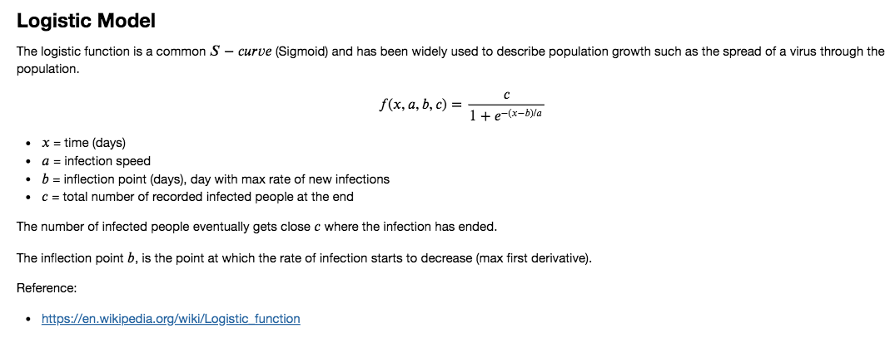
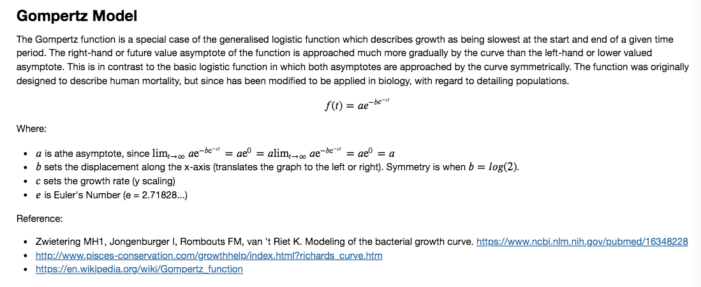
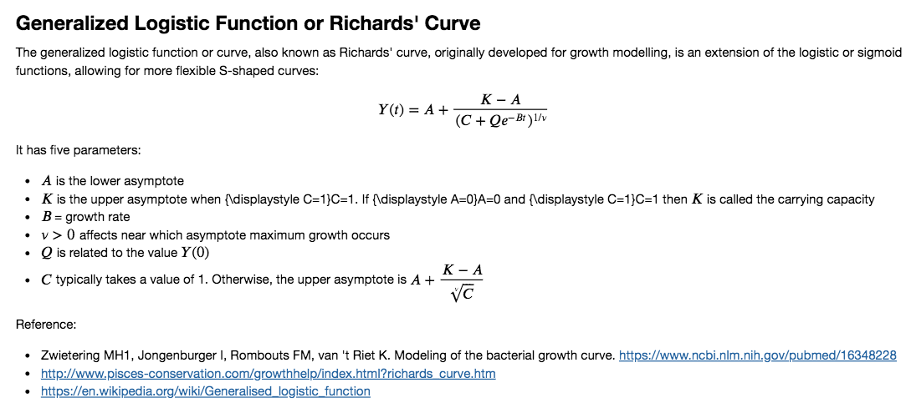
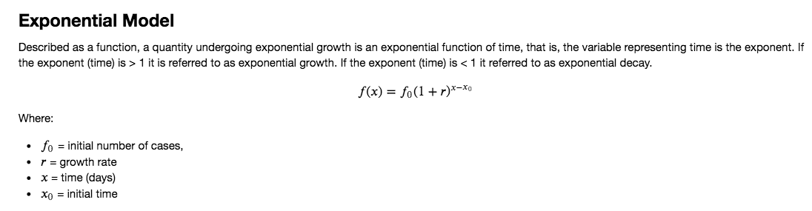

## COVID-19 Logistic Model

Data science experiments with Johns Hopkins COVID-19 dataset

Jay Urbain, PhD

Last update: 4/19/2020

The spread of a pathogen can start out slowly, but as larger numbers of the susceptible population become infected, the number of infected experiences exponential growth. Eventually this growth levels off as the size of the susceptible population decreases and the populations of the infected and recovered increase.

This can be modeled with variations of logistic (sigmoid) functions.

Data from the reference regions (Italy, South Korea, and Hubei province China) are each fitted with a logistic function beginning on the day of the 100th confirmed case in that country.  

The models for the three countries are then scaled to the U.S. population and aligned along the time-axis to best fit the US data for total confirmed cases.  

Graphing these projections together demonstrates how the U.S. compares to benchmark regions, to help give more clarity in what the U.S. path going forward might look like.

#### Model Trajectories - includes data up to an including 4/16/2020

#### US Model Stats - includes data up to an including 4/16/2020

It is not clear that the US has passed an inflection point, so expect the model to be highly variable.

> a = 5.723545327454563 +/- 0.09867448774473674
> 
> b = 76.20332533295135 +/- 0.1953938340178228
> 
> c = 811245.4053859087 +/- 10516.99660963606
> 
> errors [0.09867448774473674, 0.1953938340178228, 10516.99660963606]
> 
> Expected number of infected people at infection end: 811245.41 +/- 0.2
> 
> Infection peak in days from start: 76.2 +/- 0.2
> 
> us_inflection_date 2020-04-07T00:00:00.000000000
> 
> us_inflection_date_string 2020-04-07
> 
> days end 159
> 
> infection_end_date_string 2020-07-12

#### Daily Percent Change in US Cases

On the positive side, the percent change in US cases has been steadily 
decreasing. When this value goes below zero, the number of new cases 
reported each day will start to decrease.

#### S. Korea Piecewise Logistic-Quadratic Model, South Korea Data

#### Italy Piecewise Logistic-Quadratic Model, Italy Data

#### S. Korea, China Hubei, and Italy Models Scaled for US Population

References:

Interview Ari Libsker, Corona Is Slowing Down, Humanity Will Survive, Says Biophysicist Michael Levitt, 3/13/20.
https://www.calcalistech.com/ctech/articles/0,7340,L-3800632,00.html

Chowell, G., Sattenspiel, L., Bansal, S., & Viboud, C. (2016). Mathematical models to characterize early epidemic growth: A review. Physics of life reviews, 18, 66–97. https://doi.org/10.1016/j.plrev.2016.07.005

2019 Novel Coronavirus COVID-19 (2019-nCoV) Data Repository by Johns Hopkins CSSE
https://github.com/CSSEGISandData/COVID-19

Exponential growth and epidemics, CDC
https://www.youtube.com/watch?v=Kas0tIxDvrg

Estimating actual COVID 19 cases (novel corona virus infections) in an area based on deaths, CDC
https://www.youtube.com/watch?v=mCa0JXEwDEk

Mathematics of the Corona outbreak – with professor Tom Britton
https://www.youtube.com/watch?v=gSqIwXl6IjQ

