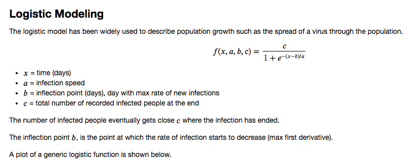
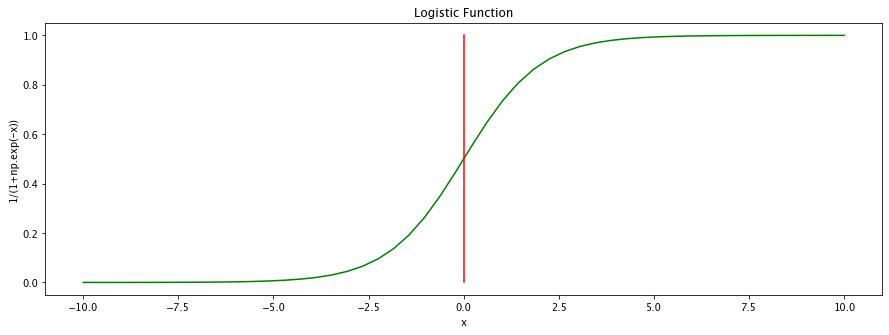

# covid19
Data science experiments with Johns Hopkins COVID-19 dataset

Jay Urbain, PhD

COVID-19 Logistic Model

References:

Interview Ari Libsker, Corona Is Slowing Down, Humanity Will Survive, Says Biophysicist Michael Levitt, 3/13/20.
https://www.calcalistech.com/ctech/articles/0,7340,L-3800632,00.html

Chowell, G., Sattenspiel, L., Bansal, S., & Viboud, C. (2016). Mathematical models to characterize early epidemic growth: A review. Physics of life reviews, 18, 66–97. https://doi.org/10.1016/j.plrev.2016.07.005

2019 Novel Coronavirus COVID-19 (2019-nCoV) Data Repository by Johns Hopkins CSSE
https://github.com/CSSEGISandData/COVID-19

Exponential growth and epidemics, CDC
https://www.youtube.com/watch?v=Kas0tIxDvrg

Estimating actual COVID 19 cases (novel corona virus infections) in an area based on deaths, CDC
https://www.youtube.com/watch?v=mCa0JXEwDEk

Mathematics of the Corona outbreak – with professor Tom Britton
https://www.youtube.com/watch?v=gSqIwXl6IjQ

Last update: 3/23/2020

> Total US Cases South Korea Model 54450.0
> 
> Total US Cases China Hubei Model 296519.0
> 
> Total US Cases Italy Model 656261.0
>
> US Inflection Date South Korea Model 2020-03-23
> 
> US Spread Tail Off Date South Korea Model 2020-05-23
>
> US Inflection Date China Hubei Model 2020-04-06
> 
> US Spread Tail Off Date China Hubei Model 2020-06-10
>
> US Inflection Date Italy Model 2020-04-05
> 
> US Inflection Date Italy Model 2020-06-18

